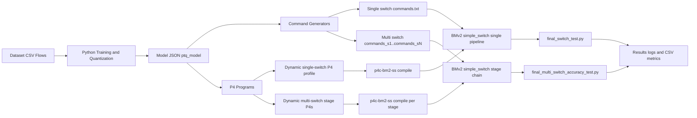

# Neural-Network IDS in P4 (BMv2)

This repository implements an Intrusion Detection System (IDS) where packet/flow features are converted into fixed-point values and evaluated directly inside P4 data planes.

The project combines:

- quantized neural network models (trained in Python)
- dynamic command generation (model JSON -> BMv2 CLI commands)
- single-switch and multi-switch BMv2 deployments
- reproducible evaluation scripts with confusion-matrix outputs

This repository provides end-to-end artifacts for practical in-network ML inference in P4, from model training to switch-runtime metrics.

---

## Why This Project Is Interesting

Most IDS pipelines push features to external ML services. Here, the decision logic is pushed into the network pipeline itself.

That enables:

- inline classification at packet/flow runtime
- deterministic integer arithmetic behavior (fixed-point pipeline)
- direct comparison between offline quantized metrics and online BMv2 behavior
- architecture experiments from compact models (`5-4-1`) to larger dynamic profiles (`9-32-16-1`)

---

## What The Repository Contains

### Model families

- `5-4-1` (single-switch)
- `9-4-1` (single-switch)
- `9-8-1` (single-switch)
- `9-8-4-1` (single-switch + multi-switch)
- `9_32_1` (single-switch + multi-switch)
- `9_32_16_1` (single-switch + multi-switch)

### Runtime framework

- `dynamic_runtime_template/`
  - dynamic single-switch command/P4 profile support
  - dynamic multi-switch stage generation, compile, deploy, smoke, cleanup

---

## Repository Structure

```text
.
|-- 5-4-1/
|-- 9-4-1/
|-- 9-8-1/
|-- 9-8-4-1/
|-- 9_32_1/
|-- 9_32_16_1/
|-- dynamic_runtime_template/
|-- requirements.txt
`-- README.md
```

Detailed docs per model/profile:

- [5-4-1/README.md](5-4-1/README.md)
- [9-4-1/README.md](9-4-1/README.md)
- [9-8-1/README.md](9-8-1/README.md)
- [9-8-4-1/README.md](9-8-4-1/README.md)
- [9_32_1/README.md](9_32_1/README.md)
- [9_32_16_1/README.md](9_32_16_1/README.md)
- [dynamic_runtime_template/README.md](dynamic_runtime_template/README.md)
- [dynamic_runtime_template/multi_switch/README.md](dynamic_runtime_template/multi_switch/README.md)

---

## End-to-End Pipeline

1. Train/export model in notebook (`offline` or `single_switch/python/code`).
2. Produce quantized model JSON (`ptq_model*.json`).
3. Generate BMv2 CLI commands from model JSON.
4. Compile P4 with `p4c-bm2-ss`.
5. Start BMv2 `simple_switch` (single or multiple stages).
6. Load table/register commands through `simple_switch_CLI`.
7. Replay/evaluate traffic samples and collect results CSV/log.

## Visual Architecture



---

## Setup

### System dependencies

- Linux (or Linux VM/container with root networking support)
- Python 3
- Jupyter Notebook
- BMv2: `simple_switch`, `simple_switch_CLI`
- P4 compiler: `p4c-bm2-ss` (or compatible `p4c` toolchain)
- `sudo`, `iproute2`

### Python environment

```bash
python3 -m venv .venv
source .venv/bin/activate
pip install -r requirements.txt
```

### Dataset

Download dataset files from:

- https://cloud.tu-ilmenau.de/s/aZR6Kk6yGdL3mmg

Place data files under repository `data/` as expected by the test scripts.

---

## Quick Start

### Single-switch run

```bash
cd <model>/online/single_switch
./reset_and_run.sh
```

### Multi-switch run

```bash
cd <model>/online/multi_switch
./reset_and_run_multi.sh
```

For dynamic template multi-switch deployment:

```bash
cd dynamic_runtime_template/multi_switch
N_SWITCHES=4 MODEL_PROFILE=auto ./reset_and_run_multi.sh
```

---

## Model-to-Entry Mapping

| Model | Notebook | Model JSON | Run script |
| --- | --- | --- | --- |
| `5-4-1` | `5-4-1/offline/python/code/md_train_model_5_4_1.ipynb` | `5-4-1/offline/python/output/ptq_model_5_4_1.json` | `5-4-1/online/single_switch/reset_and_run.sh` |
| `9-4-1` | `9-4-1/offline/python/code/md_train_model_9_4_1.ipynb` | `9-4-1/offline/python/output/ptq_model_9_4_1.json` | `9-4-1/online/single_switch/reset_and_run.sh` |
| `9-8-1` | `9-8-1/offline/python/code/md_train_model_9_8_1.ipynb` | `9-8-1/offline/python/output/ptq_model_9_8_1.json` | `9-8-1/online/single_switch/reset_and_run.sh` |
| `9-8-4-1` (single) | `9-8-4-1/offline/python/code/md_train_model_9_8_4_1.ipynb` | `9-8-4-1/offline/python/output/ptq_model_9_8_4_1.json` | `9-8-4-1/online/single_switch/reset_and_run.sh` |
| `9-8-4-1` (multi) | `9-8-4-1/offline/python/code/md_train_model_9_8_4_1.ipynb` | `9-8-4-1/offline/python/output/ptq_model_9_8_4_1.json` | `9-8-4-1/online/multi_switch/reset_and_run_multi.sh` |
| `9_32_1` (single) | `9_32_1/single_switch/python/code/md_train_model.ipynb` | `9_32_1/single_switch/python/output/ptq_model.json` | `9_32_1/single_switch/reset_and_run.sh` |
| `9_32_1` (multi) | `9_32_1/single_switch/python/code/md_train_model.ipynb` | `9_32_1/single_switch/python/output/ptq_model.json` | `9_32_1/multi_switch/reset_and_run_multi.sh` |
| `9_32_16_1` (single) | `9_32_16_1/single_switch/python/code/md_train_model.ipynb` | `9_32_16_1/single_switch/python/output/ptq_model.json` | `9_32_16_1/single_switch/reset_and_run.sh` |
| `9_32_16_1` (multi) | `9_32_16_1/single_switch/python/code/md_train_model.ipynb` | `9_32_16_1/single_switch/python/output/ptq_model.json` | `9_32_16_1/multi_switch/reset_and_run_multi.sh` |

---

## Results Snapshot

Important context:

- Offline metrics are from full dataset test splits.
- Online metrics are from BMv2 replay runs (`500`, `1000`, or `5000` sample runs depending on script/model).
- For exact experiment settings and paths, see each model README.

### A) Offline quantized metrics (from model docs)

| Model | Accuracy | Precision | Recall | F1 |
| --- | ---: | ---: | ---: | ---: |
| `5-4-1` | 92.60% | 90.45% | 99.64% | 94.83% |
| `9-4-1` | 86.03% | 96.64% | 82.34% | 88.92% |
| `9-8-1` | 89.03% | 95.12% | 88.41% | 91.64% |
| `9-8-4-1` | 86.38% | 96.62% | 82.89% | 89.23% |

### B) Online BMv2 single-switch metrics (recorded runs)

| Model | Samples | Accuracy | Precision | Recall | F1 |
| --- | ---: | ---: | ---: | ---: | ---: |
| `5-4-1` | 500 | 93.40% | 91.53% | 99.41% | 95.31% |
| `9-4-1` | 1000 | 85.10% | 96.40% | 81.45% | 88.30% |
| `9-8-1` | 1000 | 88.20% | 95.25% | 87.25% | 91.07% |
| `9-8-4-1` | 1000 | 85.20% | 96.25% | 81.74% | 88.40% |
| `9_32_1` | 5000 | 86.26% | 85.33% | 96.35% | 90.51% |
| `9_32_16_1` | 5000 | 84.96% | 82.98% | 97.97% | 89.86% |

### C) Online BMv2 multi-switch metrics (recorded runs)

| Model | Samples | Accuracy | Precision | Recall | F1 |
| --- | ---: | ---: | ---: | ---: | ---: |
| `9-8-4-1` | 1000 | 85.20% | 96.25% | 81.74% | 88.40% |
| `9_32_1` | 5000 | 75.36% | 86.13% | 76.00% | 80.75% |
| `9_32_16_1` | 5000 | 75.58% | 84.34% | 78.71% | 81.42% |

### D) Single vs multi (observed trend for large profiles)

For `9_32_1` and `9_32_16_1`, recorded multi-switch runs show:

- lower recall than single-switch runs
- slightly higher precision in some cases
- overall lower F1/accuracy compared to single-switch recorded runs

This is exactly why this repository is useful: it exposes deployment-stage effects beyond offline quantized model quality.

---

## Dynamic Runtime Template

The dynamic framework under `dynamic_runtime_template/` supports profile-aware generation:

- `one_hidden` profile (up to `9-32-1`)
- `two_hidden` profile (up to `9-32-16-1`)

Core capabilities:

- auto profile detection from model JSON
- generation of `commands.txt` (single-switch mode)
- generation of `commands_s1..commands_sN.txt` (multi-switch mode)
- dynamic P4 stage generation and compile/deploy scripts
- smoke and cleanup scripts for rapid iteration

See:

- [dynamic_runtime_template/README.md](dynamic_runtime_template/README.md)
- [dynamic_runtime_template/multi_switch/README.md](dynamic_runtime_template/multi_switch/README.md)

---

## Typical Outputs Produced By Runs

Single-switch runs usually produce:

- `commands.txt`
- compiled BMv2 JSON
- final test log
- final results CSV

Multi-switch runs usually produce:

- `commands_s1.txt ... commands_sN.txt`
- stage P4 files (`ids_nn_dynamic_s*.p4`)
- stage BMv2 JSON (`ids_nn_dynamic_s*.json`)
- final multi-switch test log
- final multi-switch results CSV

---

## Reproducibility Notes

- Run notebook first so model JSON exists before shell wrappers.
- Keep interface names and permissions consistent (`sudo`, `ip link`, veth names).
- For multi-switch dynamic `two_hidden`, enforce `N_SWITCHES=4`.
- Compare both logs and CSVs when validating results.

---

## License

No license file is currently included in this repository.
